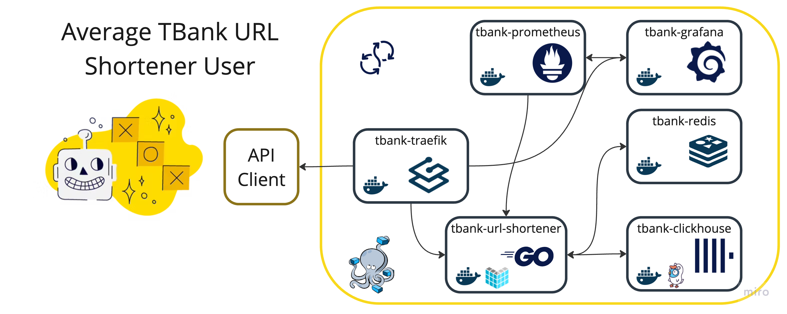
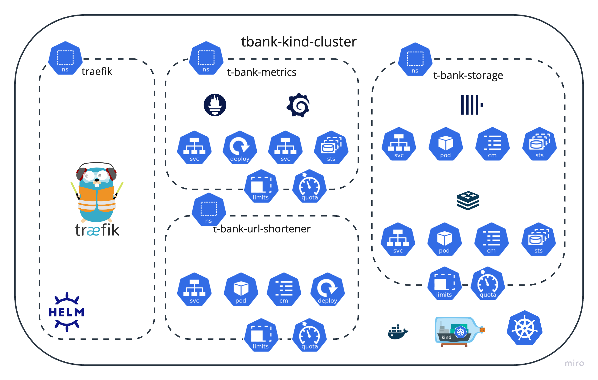
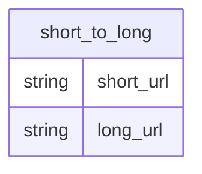

# Сервис коротких ссылок aka URL shortener
[](https://github.com/MisterZurg/TBank-backend-academy-URL-Shortener/actions?workflow=golangci-lint)
[](https://codecov.io/gh/MisterZurg/TBank_URL_shortener)
[](https://pkg.go.dev/github.com/MisterZurg/TBank-backend-academy-URL-Shortener)

[//]: # ([![Go Report Card]&#40;https://goreportcard.com/badge/MisterZurg/TBank-backend-academy-URL-Shortener?style=for-the-badge&#41;]&#40;https://goreportcard.com/report/MisterZurg/TBank-backend-academy-URL-Shortener&#41;)


<p align="center"> 
  
</p>

> [!IMPORTANT]
> В рамках данных задач стоит амбициозный и креативный проект по созданию сервиса коротких ссылок, который удобно вписывается в современный веб-ландшафт. Наш сервис будет принимать на вход стандартные REST запросы, содержащие оригинальные URL-адреса, и выдавать в ответ компактные, укороченные версии с использованием домена localhost. Пользователи, перейдя по такой короткой ссылке, будут автоматически перенаправлены на изначальный, полный адрес ресурса.

> [!NOTE]
> В качестве образца можно рассматривать сервисы типа https://surl.li/ru, которые демонстрируют функционал и потенциал сокращения ссылок.

В результате проектных работ ожидается:
1. Подробное архитектурное описание с тщательным анализом каждого принятого решения. Здесь будут освещены такие аспекты, как причины выделения функциональности в отдельный микросервис, выбор способа коммуникации – Kafka/GRPC, логика за выбором определённого типа базы данных, и другие ключевые моменты.
2. Полноценная реализация сервиса, отвечающая всем поставленным требованиям и стандартам качества. Не забудьте написать тесты для вашего проекта.
3. Docker compose файл, содержащий все необходимые настройки для быстрого и безболезненного запуска сервиса в любой среде.
4. Документация интерфейса сервиса, включающая в себя спецификацию REST запроса для генерации короткой ссылки и прочие важные детали взаимодействия с сервисом.

## Описание предлагаемого решение
### System Design Moment
#### Функциональные требования
- Для поданного URL'а на ресурс, сервис генерирует уникальный сокращенный URL.
- При использовании сокращенного URL'a, пользователья редиректит на оригинальный ресурс.
#### Нефункциональные требования
- HA
- Сервис должен быть расширяемым и эффективным
- Для улучшения пользовательского опыта, прикрутить фронтенд

> [!WARNING]
> #### Вопросы?
> - Какова ожидается нагрузка на сервис в месяц (сколько ссылок)?
> - Должны ли ссылки существовать вечно? Если нет то какой их lifespan?
> - Должны ли собираться метрики с переходов по ссылкам? Если да то какие?
> - Должен ли каждый пользователь получать уникальную сокращённую ссылку на ресурс?
> - Должна ли присутствовать фича создания кастомного url?
> - Будет ли сервис использоватсья во всем мире?
> - Бизнесс требования, 
>   - сколько у нас есть денег?
>   - сколько мы готовы ждать?
>   - как долго планируется поддерживать решения?
> Деградация функциональности, чем можем пожертвовать?

#### Экономим деньги бизнесс
> [!TIP]
> — Что за бизнес, $ука?
> [kizaru ft Барбарики](https://www.youtube.com/watch?v=IzEPJM2WbzM)


### Архитектура сервиса
#### Общее описание HighLoad решения
Используется "трёх" звеньевая архитектура - нужны разные ресурсы сервиса.
- Фронтенд, первичная валидация и безопасность; защита от
  - Шифрование
  - DDoS
  - Медленные запросы
  - Буферизация
  - Обработка ошибок
  - Кэш
  - Балансировка
- Бэкенд — вычисления
- Система хранения

**Микромонолит**

Плюсы
- Отсутствие какого-либо оверхеда при коммуникации сервисов.

Минусы
- Высокая сложность разработки
- В случае проблемы, встает всё
- Невозможность вести распределенную разработку

#### Горизонтальное масштабирование/закон Амдала
Иллюстрирует ограничение роста производительности выислительной системы с увеличением количества вычислителей.

| Разделяемый компонет |  10 вычислителей   |  100 вычислителей   |  1000 вычислителей   |
|:--------------------:|:------------------:|:-------------------:|:--------------------:|
|          0%          | Ускорение в 10 раз | Ускорение в 100 раз | Ускорение в 1000 раз |
|         10%          |        5.3         |         9.2         |         9.9          |
|         25%          |        3.0         |         3.9         |         4.0          |
|         40%          |        2.1         |         2.4         |         2.5          |

> Higload Горизонтальное масштабирование

#### Технологии
> [!CAUTION]
> Vue (Vite + Bun) - прост в использовании/производителен/2 место по полюрности 2023г

Echo - расширяемый производительный фреймворк с большим кол-вом мидлварей
Redis - в плане кеша конкуренты отсутствуют (Memcached ограничен, KeyDB ещё в перспективе)
ClickHouse - аппенд онли дб, высокой производительности, отказоустойчивости и масштабируемости.
Traefik - opensource reverse-proxy, автаматически дискаверящий сервисы будь то контейнеры или поды

#### DockerCompose Infra


> [!CAUTION]
> Балансировка на уровне кубера
> Фронт продаем клиенту

```shell
# start DockerCompose Infra
make up
```
```shell
# stop DockerCompose Infra
make down
```

#### K8S Infra

> [!WARNING]
> Kind не может в External IP
> [Using MetalLb with Kind](https://mauilion.dev/posts/kind-metallb/)
> [METALLB](https://metallb.universe.tf/installation/)
> [MetalLB and NGINX Ingress // Setup External Access for Kubernetes Applications](https://www.youtube.com/watch?v=k8bxtsWe9qw&list=WL)

#### Cloud Infra?
> [!WARNING]
> HashiCorp moment?
> We have to hire CloudOps and add
> - vault
> - consul
> - waypoint
> - boundary
> - terraform (have to write terraform modules for each cloud provider)

### Контракты можно тестировать в .http
```http request
POST localhost:1323/short-it HTTP/1.1
Host: localhost:1323
Content-Type: application/json
Accept: */*

{
  "long_url": "<YOUR_URL>"
}

# Returns OK (200), with the generated <SHORT_URL> in data
```

```http request
GET localhost:1323/short-it/<SHORT_URL> HTTP/1.1
Host: localhost:1323
Content-Type: application/json
Accept: */*

# Returns StatusFound (302) redirects user
```

### Database Schema


### Shortening Algorithm
> [!IMPORTANT]
> shortuuid — generates UUIDs using google/uuid and then translate it to base57 using lowercase and uppercase letters and digits,
> and removing similar-looking characters such as l, 1, I, O and 0.

### Собираемые Метрики
- tbank_processed_ops_total — The total number of processed events
- tbank_url_shortener_usage_redirect — The number of redirects
- tbank_url_shortener_usage_create — The number of short urls creation
- tbank_url_shortener_cache_usage — The number of cache usage
- tbank_url_shortener_db_usage — The number of db usage
- tbank_url_shortener_errors_total — The number of errors

### Используемые зависимости и тулы
- [echo](https://github.com/labstack/echo) high performance, minimalist Go web framework. Task included by default
- [clickhouse-go](https://github.com/ClickHouse/clickhouse-go) driver for ClickHouse
- [go-redis](https://github.com/redis/go-redis) redis client for Go
- [prometheus](https://prometheus.io/docs/guides/go-application/) open-source systems monitoring and alerting toolkit
- [goose](https://github.com/pressly/goose) database migration tool
- [env](https://github.com/caarlos0/env) simple and zero-dependencies library to parse environment variables into structs
- [shortuuid](https://github.com/lithammer/shortuuid) generates concise, unambiguous, URL-safe UUIDs that are used for shorten urls
- [swaggo](https://github.com/swaggo/swag) automatically generate RESTful API documentation with Swagger 2.0

### Откуда бралось вдохновение
- [Олег Бунин Highload](https://www.linkedin.com/in/olegbunin/)
- [Tiny URL - System Design Interview Question (URL shortener)](https://www.youtube.com/watch?v=Cg3XIqs_-4c)
- [System Design : Scalable URL shortener service like TinyURL](https://medium.com/@sandeep4.verma/system-design-scalable-url-shortener-service-like-tinyurl-106f30f23a82)
- [Учимся разрабатывать REST API на Go на примере сокращателя ссылок](https://habr.com/ru/companies/selectel/articles/747738/)
- [System Design: URL Shortener](https://dev.to/karanpratapsingh/system-design-url-shortener-10i5)