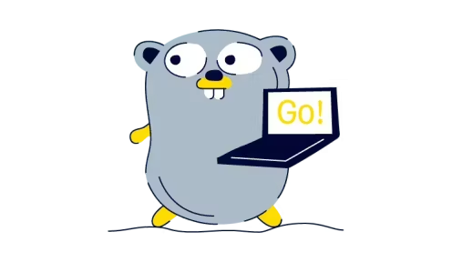

# Сервис коротких ссылок aka URL shortener
[](https://github.com/MisterZurg/TBank_URL_shortener/actions?workflow=golangci-lint)
[](https://codecov.io/gh/MisterZurg/TBank_URL_shortener)
[](https://pkg.go.dev/MisterZurg/TBank_URL_shortener)

> [!INFO]
> 
> В рамках данных задач стоит амбициозный и креативный проект по созданию сервиса коротких ссылок, который удобно вписывается в современный веб-ландшафт. Наш сервис будет принимать на вход стандартные REST запросы, содержащие оригинальные URL-адреса, и выдавать в ответ компактные, укороченные версии с использованием домена localhost. Пользователи, перейдя по такой короткой ссылке, будут автоматически перенаправлены на изначальный, полный адрес ресурса.

> [!NOTE]
> В качестве образца можно рассматривать сервисы типа https://surl.li/ru, которые демонстрируют функционал и потенциал сокращения ссылок.

В результате проектных работ ожидается:
1. Подробное архитектурное описание с тщательным анализом каждого принятого решения. Здесь будут освещены такие аспекты, как причины выделения функциональности в отдельный микросервис, выбор способа коммуникации – Kafka/GRPC, логика за выбором определённого типа базы данных, и другие ключевые моменты.
2. Полноценная реализация сервиса, отвечающая всем поставленным требованиям и стандартам качества. Не забудьте написать тесты для вашего проекта.
3. Docker compose файл, содержащий все необходимые настройки для быстрого и безболезненного запуска сервиса в любой среде.
4. Документация интерфейса сервиса, включающая в себя спецификацию REST запроса для генерации короткой ссылки и прочие важные детали взаимодействия с сервисом.

Как какать?
```shell
make todo
```
Контракты можно тестировать в .http

## Используемые зависимости и тулы
- [echo](https://github.com/labstack/echo) high performance, minimalist Go web framework. Task included by default
- [oapi-codege](https://github.com/deepmap/oapi-codegen) Client and Server Code Generator from the oapi.json
- [sqlx](https://github.com/jmoiron/sqlx) extension on go's standard database/sql
- [pgx](https://github.com/jackc/pgx) pure Go driver and toolkit for PostgreSQL
- [kafka-go](https://github.com/segmentio/kafka-go) low and high level APIs for interacting with Kafka
- [go-redis](https://github.com/redis/go-redis) redis client for Go
- [goose](https://github.com/pressly/goose) database migration tool
- [env](https://github.com/caarlos0/env) simple and zero-dependencies library to parse environment variables into structs

## Откуда бралось вдохновение
- [Tiny URL - System Design Interview Question (URL shortener)](https://www.youtube.com/watch?v=Cg3XIqs_-4c)
- [Учимся разрабатывать REST API на Go на примере сокращателя ссылок](https://habr.com/ru/companies/selectel/articles/747738/)